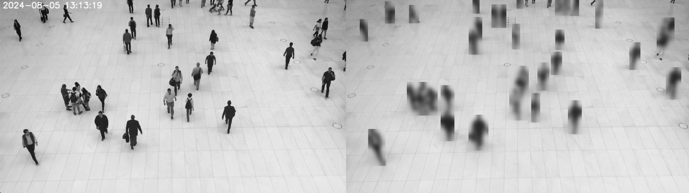

# Axon Test Project

This project demonstrates a video processing pipeline using OpenCV and multiprocessing. The pipeline includes reading frames from a video, detecting motion, blurring detected regions, and displaying the blurred frames.

## Example Output

Below is an example of the output showing the blurred result:

